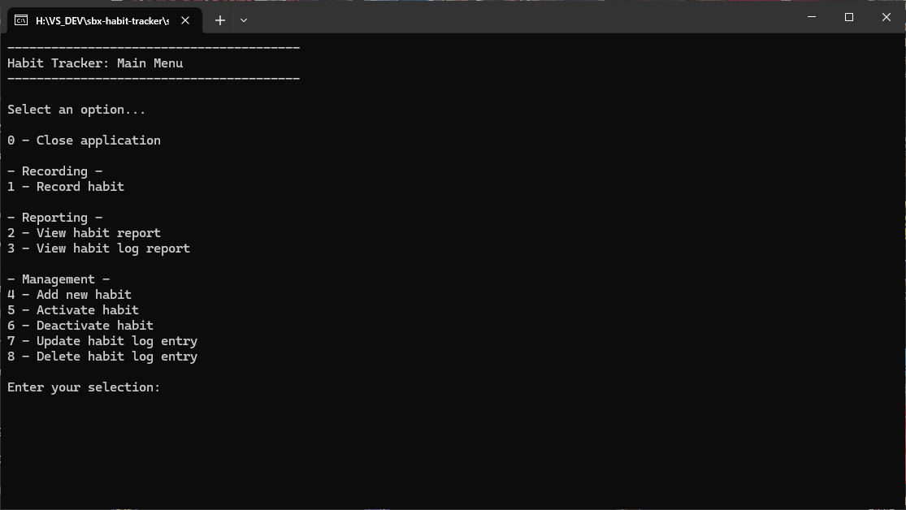

<h1>Habit Tracker</h1>

Welcome to the Habit Tracker App!

This is a simple interactive application that was built as a demo application to demonstrate CRUD operations against a database.

It is run as a console application and allows a user to create, read, update and delete habit records with an sqlite database backend.

## Features

The application is a console based user interface where users can navigate the following functionality with key presses:

- **View All Records**:

	Returns all entries from the database and displays them in the console.

- **Insert Record**
 
	Prompts the user for inputs, validates inputs, then creates a new entry in the database.

- **Delete Record**

	Displays all entries in the database, prompts the user for the ID to delete, then deletes if valid.

- **Update Record**

	Displays all entries in the database, prompts the user for the ID to update, prompts the user for inputs, validates, then updates if valid.
 
## Getting Started

### Prerequisites

- .NET 8 SDK installed on your system.
- A code editor like Visual Studio or Visual Studio Code

### Installation

#### Console

1. Clone the repository:
	- `git clone https://github.com/cjc-sweatbox/habit-tracker.git`

2. Navigate to the project directory:
	- `cd src\math-game\HabitTracker.ConsoleApp`

3. Run the application using the .NET CLI:
	- `dotnet run`

### Running the Application

1. Run the application using the .NET CLI in the project directory:
	- `dotnet run`

## Usage

When you start the application, you will be presented with the main menu:

Choose option **0** to close the application:

Choose option **1** to view all records:

Choose option **2** to insert a record:

Choose option **3** to delete a record:

Choose option **4** to update a record:

## How It Works

- **Menu Navigation**: Navigate through the menu using the provided options perform an action.
- **Data Storage**: A new sqlite database is created and required tables set up at run-time, or an existing database is used if already created.

## Contributing

Contributions are welcome! Please fork the repository and create a pull request with your changes. For major changes, please open an issue first to discuss what you would like to change.

## License

This project is licensed under the MIT License. See the [LICENSE](./LICENSE) file for details.

## Contact

For any questions or feedback, please open an issue.

---
***Happy Habit Tracking!***
